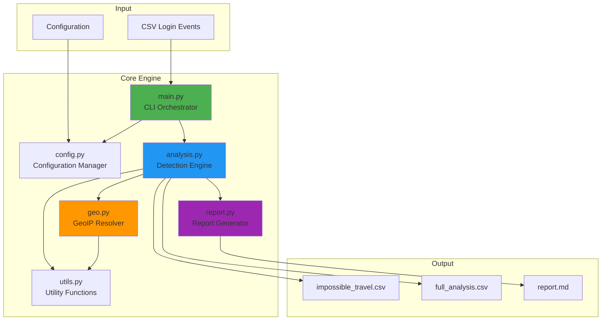
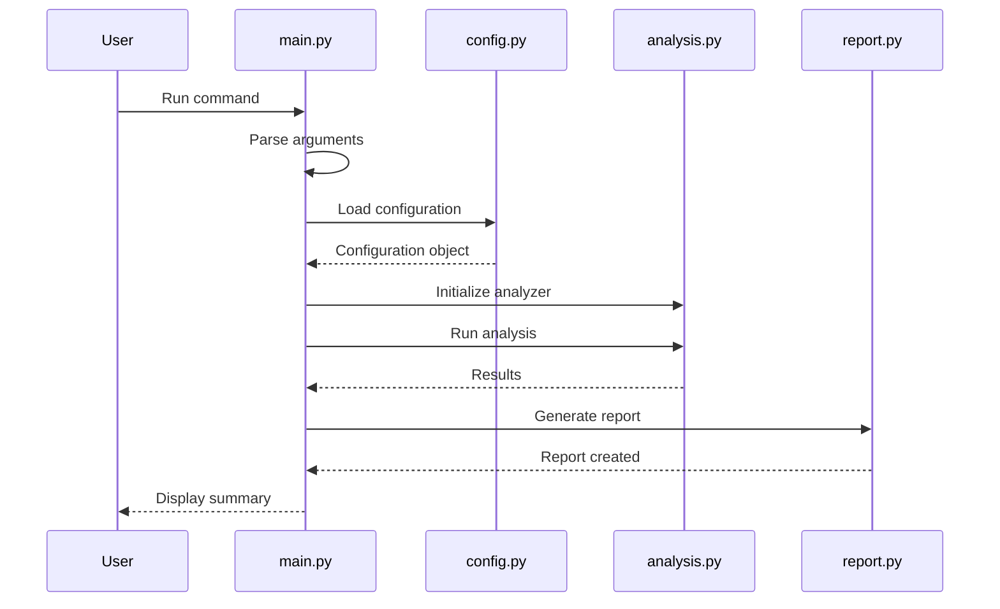
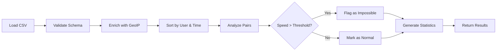
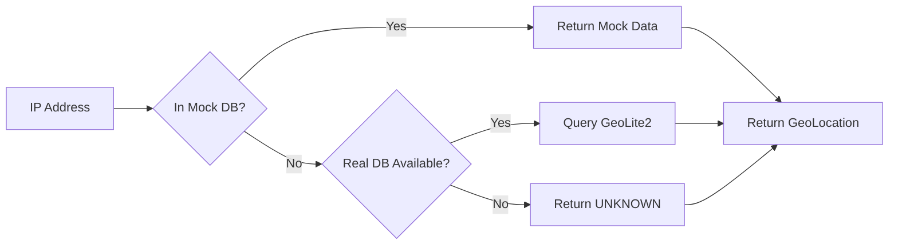
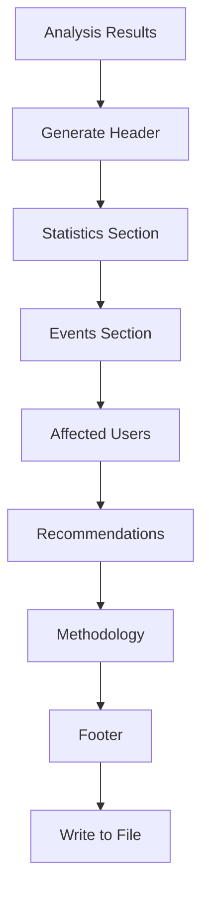
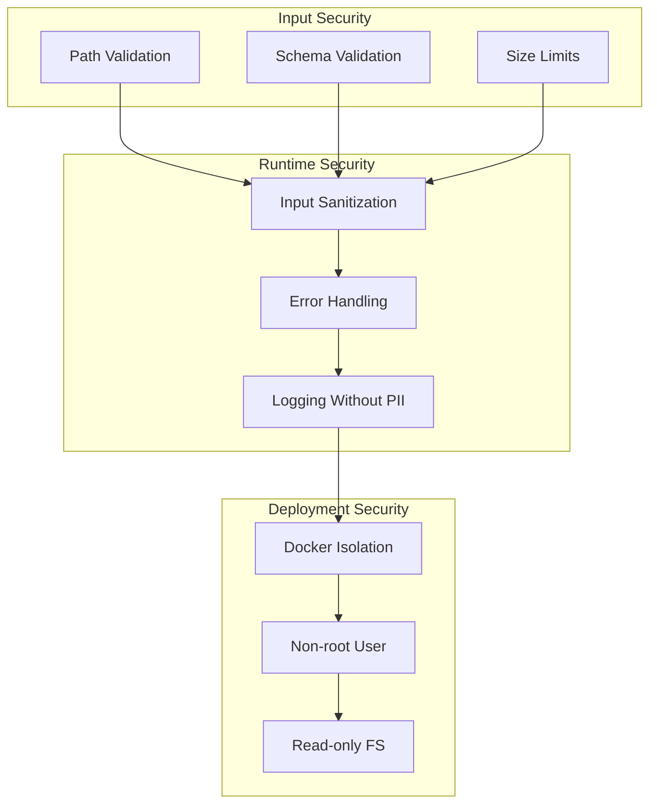
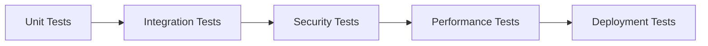
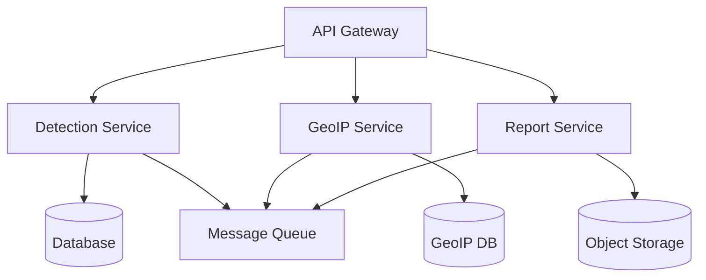

# Architecture Documentation

## System Overview

The Impossible Travel Detection Engine is a modular, security-focused Python application designed to analyze login events and detect impossible travel patterns—a key indicator of account compromise.

## Design Principles

1. **Separation of Concerns**: Each module has a single, well-defined responsibility
2. **Configurability**: Behavior is controlled through configuration, not code changes
3. **Extensibility**: Easy to add new detection algorithms or data sources
4. **Testability**: All components are independently testable
5. **Security First**: Secure defaults, input validation, and minimal privileges

## System Architecture



## Component Architecture

### 1. CLI Orchestrator (main.py)

**Responsibility**: Entry point, argument parsing, workflow orchestration



**Key Functions**:
- Command-line argument parsing
- Validation of inputs
- Workflow coordination
- Error handling and logging setup
- Output generation

### 2. Configuration Manager (config.py)

**Responsibility**: Centralized configuration management

```python
@dataclass
class DetectionConfig:
    speed_threshold_kmh: float = 1000.0
    min_time_diff_minutes: float = 1.0
    geo_db_path: Optional[str] = None
    # ... more configuration
```

**Features**:
- Environment variable support
- Configuration validation
- Type-safe configuration objects
- Default values with override capability

### 3. Detection Engine (analysis.py)

**Responsibility**: Core impossible travel detection logic



**Detection Algorithm**:

1. **Load & Validate**: Read CSV and verify schema
2. **Enrich**: Add geographic coordinates via GeoIP lookup
3. **Group**: Organize events by user_id
4. **Analyze**: For each consecutive login pair:
   - Calculate distance using Haversine formula
   - Calculate time difference
   - Compute required travel speed
   - Flag if speed > threshold
5. **Aggregate**: Generate summary statistics

**Classes**:
- `ImpossibleTravelAnalyzer`: Main detection class

**Methods**:
- `load_login_data()`: CSV ingestion
- `enrich_with_geolocation()`: GeoIP enrichment
- `analyze_travel_patterns()`: Core detection logic
- `filter_impossible_travel()`: Result filtering
- `get_summary_statistics()`: Statistics generation

### 4. GeoIP Resolver (geo.py)

**Responsibility**: IP address to geographic location resolution



**Components**:
- `GeoLocation`: Data class for location info
- `GeoIPResolver`: Resolution engine with mock/real DB support

**Features**:
- Mock database for testing (20+ cities)
- Real GeoLite2 database support (commented, ready for production)
- Graceful fallback to UNKNOWN for unresolved IPs
- Context manager support for resource cleanup

### 5. Utility Functions (utils.py)

**Responsibility**: Reusable mathematical and formatting functions

**Key Functions**:

```python
def haversine_distance(lat1, lon1, lat2, lon2) -> float:
    """Calculate great-circle distance using Haversine formula"""

def calculate_time_diff_hours(timestamp1, timestamp2) -> float:
    """Calculate time difference in hours"""

def calculate_required_speed(distance_km, time_hours) -> float:
    """Calculate required travel speed"""

def format_location(city, country) -> str:
    """Format location for display"""
```

**Haversine Formula Implementation**:

The Haversine formula calculates the shortest distance between two points on a sphere:

```
a = sin²(Δφ/2) + cos(φ1) · cos(φ2) · sin²(Δλ/2)
c = 2 · atan2(√a, √(1−a))
distance = R · c
```

Where:
- φ = latitude in radians
- λ = longitude in radians
- R = Earth's radius (6,371 km)

### 6. Report Generator (report.py)

**Responsibility**: Markdown report generation



**Report Sections**:
1. Executive Summary
2. Key Findings (statistics table)
3. Impossible Travel Events (top events by speed)
4. Affected Users Summary
5. Security Recommendations
6. Technical Methodology
7. References & Disclaimer

## Data Flow

### Input Processing

```
CSV File
  ↓
Schema Validation (user_id, timestamp, ip_address)
  ↓
Data Loading (pandas DataFrame)
  ↓
Sorting (by user_id, then timestamp)
  ↓
GeoIP Enrichment
```

### Detection Pipeline

```
For each user:
  For each consecutive login pair:
    ┌─────────────────────────┐
    │ Extract coordinates     │
    └──────────┬──────────────┘
               ↓
    ┌─────────────────────────┐
    │ Calculate distance (km) │
    │ Using Haversine         │
    └──────────┬──────────────┘
               ↓
    ┌─────────────────────────┐
    │ Calculate time (hours)  │
    └──────────┬──────────────┘
               ↓
    ┌─────────────────────────┐
    │ Compute speed (km/h)    │
    │ speed = distance / time │
    └──────────┬──────────────┘
               ↓
    ┌─────────────────────────┐
    │ Check threshold         │
    │ speed > 1000 km/h?      │
    └──────────┬──────────────┘
               ↓
         Flag/Pass Event
```

### Output Generation

```
Analysis Results
  ├── impossible_travel.csv (flagged events only)
  ├── full_analysis.csv (all transitions)
  └── report.md (comprehensive markdown report)
```

## Security Architecture

### Threat Model

**Assets Protected**:
- User login data (PII)
- IP addresses
- Geolocation information
- Analysis results

**Potential Threats**:
1. Unauthorized access to sensitive data
2. CSV injection attacks
3. Path traversal via file paths
4. Resource exhaustion (large files)
5. Dependency vulnerabilities

**Mitigations**:
1. Input validation on all file paths
2. CSV schema validation
3. File size limits (configurable)
4. Regular dependency updates
5. Docker container isolation
6. Non-root user execution
7. Read-only file system in containers

### Security Layers



## Scalability Considerations

### Current Performance

- **Small datasets (<1,000 events)**: < 1 second
- **Medium datasets (<10,000 events)**: < 5 seconds
- **Large datasets (<100,000 events)**: < 60 seconds

### Scaling Strategies

1. **Batch Processing**: Process large files in configurable batches
2. **Caching**: Cache GeoIP lookups for repeated IPs
3. **Parallel Processing**: Use multiprocessing for user-level parallelization
4. **Database Backend**: Store historical data in SQLite/PostgreSQL
5. **Distributed Processing**: Spark/Dask for very large datasets

### Memory Optimization

- Stream-based CSV reading for large files
- Chunk processing with pandas
- Generator functions for result iteration

## Extension Points

### Adding New Detection Algorithms

```python
# In analysis.py
class ImpossibleTravelAnalyzer:
    def add_custom_detector(self, detector_func):
        """Add custom detection logic"""
        self.custom_detectors.append(detector_func)
```

### Adding New GeoIP Sources

```python
# In geo.py
class CustomGeoIPResolver(GeoIPResolver):
    def resolve(self, ip_address):
        # Custom resolution logic
        return GeoLocation(...)
```

### Adding New Output Formats

```python
# In report.py
class ReportGenerator:
    def generate_json_report(self, data):
        """Generate JSON format report"""
```

## Testing Architecture

### Test Structure

```
tests/
├── test_utils.py       # Unit tests for utilities
├── test_geo.py         # GeoIP resolution tests
├── test_analysis.py    # Detection engine tests
└── fixtures/           # Test data fixtures
```

### Test Coverage

- **Unit Tests**: All utility functions
- **Integration Tests**: Full pipeline execution
- **Mock Data**: 20+ test IP addresses with known locations
- **Edge Cases**: Zero time diff, same location, unknown IPs

### Testing Strategy



## Deployment Architecture

### Local Deployment

```
User Machine
└── Python 3.8+
    └── Virtual Environment
        └── Application
```

### Docker Deployment

```
Host System
└── Docker Engine
    └── Container (Python 3.11-slim)
        ├── Non-root user (UID 1000)
        ├── Application code
        ├── Input volume mount
        └── Output volume mount
```

### Cloud Deployment

```
Cloud Platform (AWS/Azure/GCP)
├── Container Service (ECS/AKS/GKE)
│   └── Docker Container
├── Storage (S3/Blob/GCS)
│   ├── Input files
│   └── Output files
└── Monitoring (CloudWatch/Monitor/Stackdriver)
    └── Logs & Metrics
```

## Configuration Management

### Configuration Hierarchy

```
1. Default Values (config.py)
   ↓
2. Environment Variables (ITKDP_*)
   ↓
3. Command-line Arguments (--arg)
```

### Environment Variables

```bash
ITKDP_SPEED_THRESHOLD=1000.0    # Speed threshold in km/h
ITKDP_MIN_TIME_DIFF=1.0          # Minimum time difference in minutes
ITKDP_GEO_DB_PATH=/path/to/db    # GeoIP database path
ITKDP_OUTPUT_DIR=./output        # Output directory
ITKDP_LOG_LEVEL=INFO             # Logging level
ITKDP_BATCH_SIZE=1000            # Batch processing size
ITKDP_ENABLE_CACHE=true          # Enable caching
```

## Logging Architecture

### Log Levels

- **DEBUG**: Detailed diagnostic information
- **INFO**: General information about execution
- **WARNING**: Potential issues or unexpected behavior
- **ERROR**: Errors that don't stop execution
- **CRITICAL**: Fatal errors requiring immediate attention

### Log Format

```
%(asctime)s - %(name)s - %(levelname)s - %(message)s
2025-01-19 10:30:15 - analysis - INFO - Loaded 30 login events
```

### Logging Best Practices

1. No PII in logs (user IDs are hashed/redacted)
2. Structured logging for machine parsing
3. Log rotation to prevent disk exhaustion
4. Secure log storage with appropriate permissions

## Future Architecture Enhancements

### Planned Improvements

1. **Real-time Processing**: Stream processing with Kafka/Redis
2. **ML Integration**: Anomaly detection using scikit-learn
3. **API Server**: REST API with FastAPI
4. **Dashboard**: Web UI with React/Vue
5. **Database Integration**: PostgreSQL for historical analysis
6. **Multi-tenancy**: Support for multiple organizations
7. **Advanced Analytics**: Risk scoring, user behavior profiles

### Microservices Architecture (Future)



## References

- [Clean Architecture Principles](https://blog.cleancoder.com/uncle-bob/2012/08/13/the-clean-architecture.html)
- [SOLID Principles](https://en.wikipedia.org/wiki/SOLID)
- [12-Factor App](https://12factor.net/)
- [Python Best Practices](https://docs.python-guide.org/)

---

Last Updated: 2025-01-19
